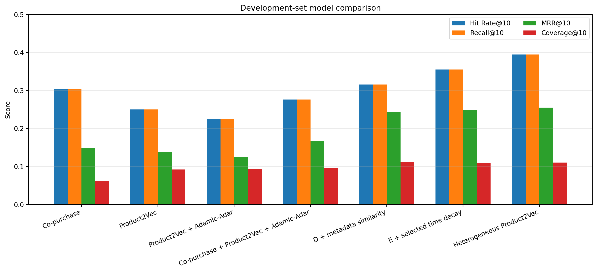
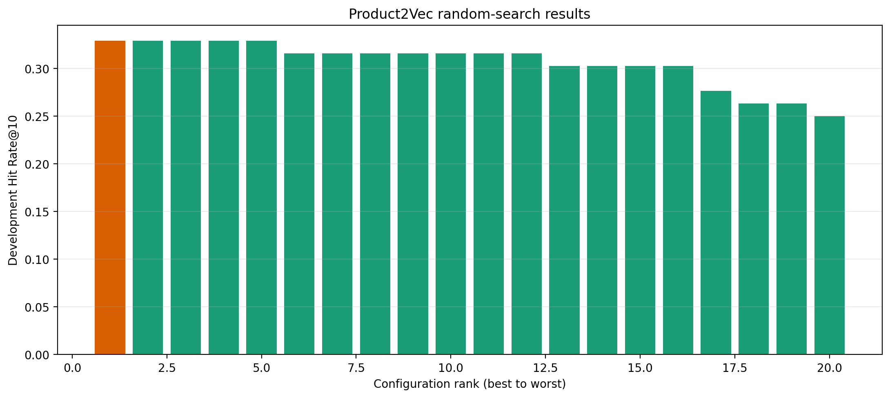
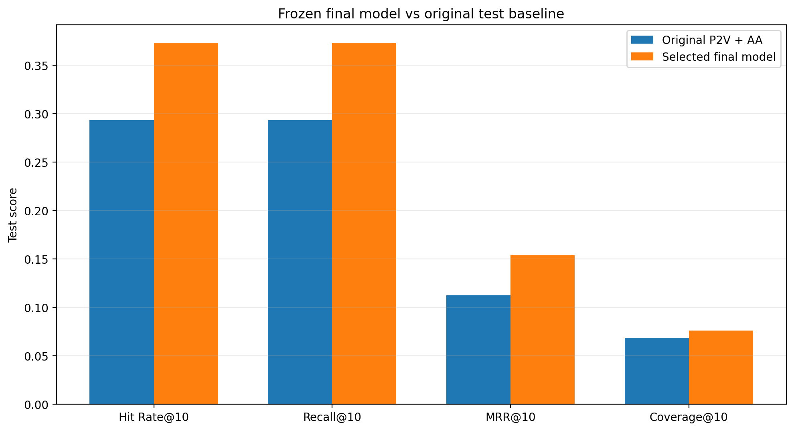
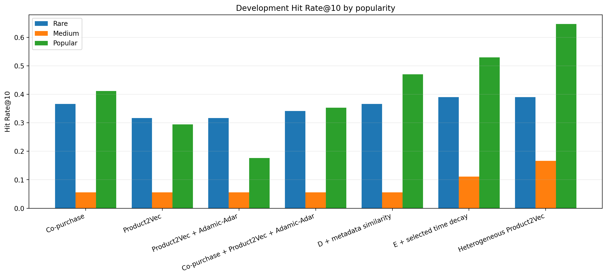
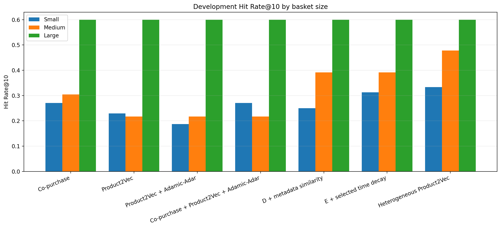
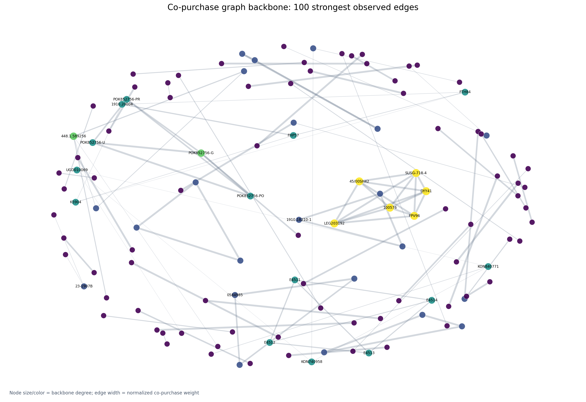
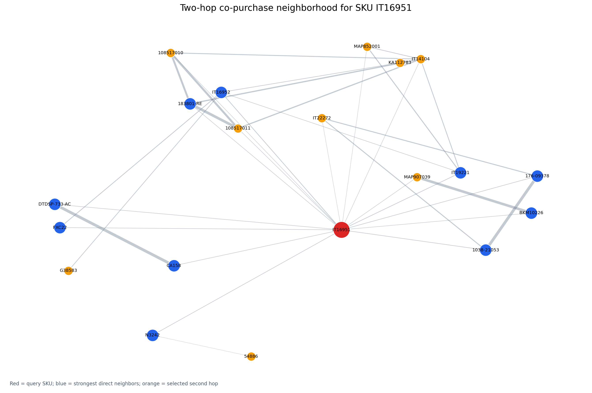

# A Hybrid Graph and Content-Aware Recommendation System for an Online Toy Shop

**Course:** Machine Learning and Content Analysis

**Project:** Odos Ermou Toy Recommendation System

**Members:** [Add full name(s) and student ID(s)]

**Date:** [Add submission date]

## Abstract

This project develops and evaluates a local product recommendation system for
an online toy shop. The system learns from 14,178 historical order lines,
representing 9,727 orders and 6,257 products, collected between April 2019 and
June 2026. Products are represented as nodes in a weighted co-purchase graph.
The project combines direct co-purchase evidence, Node2vec-style product
embeddings learned with Skip-Gram and negative sampling, and structured content
metadata such as category, brand, age, hero, and gender. A chronological
train/development/test protocol protects the final evaluation from model-
selection leakage.

The selected model assigns 40% of its score to direct co-purchase evidence, 30%
to Product2Vec, and 30% to metadata similarity. It improves Hit Rate@10 from
0.293 to 0.373, MRR@10 from 0.112 to 0.154, and catalog coverage from 0.068 to
0.076 on the one-time test set of 75 eligible basket-completion queries. Rare-
product Hit Rate@10 rises from 0.108 to 0.162, although this remains the main
weakness. The final system is packaged as a persisted local model and a
Streamlit product-page interface with separate Similar items and Frequently
bought together sections, inventory restrictions, score explanations, and CSV
export. The reported test figures belong to the combined offline hybrid; the
two product-page sections are serving views that still require section-specific
evaluation. No external API or personal customer profile is required.

## Table of Contents

1. [Introduction](#1-introduction)
   1. [Our Project](#11-our-project)
   2. [Our Vision and Goals](#12-our-vision-and-goals)
2. [Methodology](#2-methodology)
   1. [Data Collection](#21-data-collection)
   2. [Dataset Overview](#22-dataset-overview)
   3. [Data Processing, Annotation, and Normalization](#23-data-processing-annotation-and-normalization)
   4. [Algorithms, NLP Architectures, and Systems](#24-algorithms-nlp-architectures-and-systems)
3. [Experiments: Setup and Configuration](#3-experiments-setup-and-configuration)
4. [Results and Quantitative Analysis](#4-results-and-quantitative-analysis)
5. [Qualitative and Error Analysis](#5-qualitative-and-error-analysis)
6. [Discussion, Comments, and Future Work](#6-discussion-comments-and-future-work)
7. [Members and Roles](#7-members-and-roles)
8. [Time Plan](#8-time-plan)
9. [Bibliography](#9-bibliography)
10. [Appendices](#10-appendices)

## 1. Introduction

### 1.1 Our Project

Online shops often contain thousands of products, making it difficult for a
customer to discover relevant accessories, alternatives, or products belonging
to the same theme. The business problem addressed in this project is therefore:

> When a customer views one product, which alternatives should appear under
> **Similar items**, and which complements should appear under **Frequently
> bought together**?

The project focuses on product-to-product recommendation rather than user
profiling. Historical orders provide implicit evidence: two products appearing
in the same order form a co-purchase relationship. Structured catalog fields
provide content evidence even when a product is rare. For example, purchase
data may connect a LEGO set to a storage box, while metadata can identify other
LEGO sets as alternatives. The product page presents these relationship types
separately instead of mixing them into one unexplained list.

This distinction between *complements* and *substitutes* guided the model
design. Co-purchase relationships usually indicate complements. Product
metadata often indicates substitutes or thematically similar products. The
final hybrid uses both signals, allowing the system to remain behaviorally
grounded while improving representation of the long tail.

### 1.2 Our Vision and Goals

The vision is to create a recommendation system that is useful to the shop,
methodologically defensible for an academic project, and simple enough to run
locally. The concrete goals are:

1. discover recurring product combinations in order baskets;
2. construct an interpretable product graph with normalized relationship
   strengths;
3. learn dense representations of graph position with an NLP-inspired
   Skip-Gram architecture;
4. integrate structured product content without allowing broad metadata hubs
   to dominate behavior;
5. compare baselines and model variants on chronologically later orders;
6. investigate rare products and other error segments, rather than reporting a
   single aggregate accuracy value;
7. prevent repeated use of the final test set during model selection; and
8. deploy the frozen model through an inventory-aware interface.

The project does not attempt to personalize by customer identity. It also does
not optimize price, margin, stock, diversity, or conversion because these
signals are not available in the analytical dataset. Those limitations define
future work rather than hidden assumptions.

## 2. Methodology

### 2.1 Data Collection

The source is a private WooCommerce Excel order export. The workbook contains
order identifiers, timestamps, order status, SKU, product name, quantity and
value fields, and Greek/English catalog attributes. The raw export is excluded
from Git because it may contain billing, shipping, or location information.
Only aggregate product-level outputs are versioned.

Rows with a missing order identifier or unusable SKU are removed. The requested
policy retains every exported order status, including cancelled, failed,
pending, pickup, refunded, and completed orders. This choice treats an
unsuccessful transaction as possible evidence of shopping intent. It is not
assumed to be universally correct: status policies are compared on development
data, and the all-status policy is retained because it performs best there.

No external API, web scraping, or third-party customer data is used. All
processing is reproducible from the local workbook and source code.

### 2.2 Dataset Overview

After basic validation, the dataset has the following shape:

| Property | Value |
|---|---:|
| Order lines | 14,178 |
| Distinct orders | 9,727 |
| Distinct SKUs | 6,257 |
| First timestamp | 15 April 2019 |
| Last timestamp | 19 June 2026 |
| Single-product orders | 7,436 (76.5%) |
| Multi-product orders | 2,291 (23.5%) |
| Mean distinct products per order | 1.46 |

The high proportion of single-product orders is important. Only multi-product
orders can directly provide basket-completion queries, and sparse co-purchase
data makes rare products difficult. The development and test evaluations
therefore contain far fewer queries than total orders.

The catalog uses six principal content fields. Missing catalog values are
represented as `Unknown` after aggregation:

| Content field | Unknown products | Share of catalog |
|---|---:|---:|
| Product name | 0 | 0.0% |
| Product category | 0 | 0.0% |
| Brand | 584 | 9.3% |
| Age | 1,026 | 16.4% |
| Hero/franchise | 4,746 | 75.9% |
| Gender | 1,025 | 16.4% |

Hero/franchise is especially incomplete, so it receives less weight than
category or age. Missing content is excluded from similarity calculations
rather than treated as a meaningful shared value.

### 2.3 Data Processing, Annotation, and Normalization

#### Validation and text preparation

The loader verifies the required order ID, status, and SKU fields. Text is
HTML-unescaped, Unicode-normalized with NFKC, stripped, and collapsed to single
whitespace. Textual missing markers such as `nan`, `none`, `null`, and `n/a`
become actual missing values. SKUs are retained as strings so leading zeroes are
not lost.

#### Annotation strategy

The project uses existing product attributes as weak structured annotations:
category, brand, age, hero, and gender. It does not claim that these fields were
manually annotated for this experiment. One catalog row is built for each SKU;
when order lines disagree, the most frequent non-null value is selected. This
creates deterministic product-level labels while acknowledging that source
metadata can be incomplete or inconsistent.

#### Basket construction

Order lines are grouped by order ID. Duplicate occurrences of a SKU inside one
order are collapsed, so a pair count measures orders containing both products,
not purchased quantity. Every unordered product pair in a multi-item order
becomes graph evidence.

#### Co-purchase normalization

Raw pair frequency favors globally popular products. The selected graph uses a
cosine-style association:

```text
w(i,j) = c(i,j) / sqrt(c(i) × c(j))
```

Here, `c(i,j)` is the number of baskets containing both products and `c(i)` is
the number containing product `i`. For ranking direct neighbors, directional
confidence is used:

```text
confidence(i → j) = c(i,j) / c(i)
```

This answers a practical question: conditional on observing product `i`, how
often was product `j` also present?

#### Time normalization

The selected model applies a six-month exponential half-life relative to the
end of each training period. Recent baskets contribute more than old baskets,
while no development or test timestamp influences training weights. The method
adapts to assortment and demand changes without discarding older evidence.

### 2.4 Algorithms, NLP Architectures, and Systems

#### FP-Growth

FP-Growth compresses baskets into a frequent-pattern tree and mines recurring
itemsets without generating the large candidate sets required by Apriori [1].
The project uses minimum support 0.002 and limits reported sets to three SKUs.
This stage is mainly descriptive: it exposes common combinations and validates
that the basket construction is plausible.

#### Co-purchase graph

Each SKU is a node. An undirected edge exists when two products occur in the
same basket. The deployment graph has 6,257 product nodes and 8,841 edges. It is
sparse, so removing edges with pair count below two or three loses valuable
long-tail information. Direct recommendation aggregates evidence from every
product in the input cart.

#### Product2Vec: Node2vec and Skip-Gram

Node2vec learns node representations by generating biased random walks that
preserve graph neighborhoods [2]. A walk is treated like an NLP sentence: SKUs
are tokens, and nearby walk positions form center-context examples. The local
Skip-Gram model predicts graph context from a center product and uses negative
sampling, following the representation-learning principle introduced for word
embeddings [3]. The result is a 48-dimensional vector per known SKU. Candidate
products are retrieved by cosine similarity to the normalized mean vector of
the cart.

This is an **NLP-inspired architecture**, not conventional text-language
understanding. The tokens are product and metadata nodes rather than words from
descriptions. The distinction is important for accurate reporting.

#### Adamic–Adar link prediction

Adamic–Adar scores an unobserved link through shared graph neighbors, giving
more weight to uncommon neighbors [4]:

```text
AA(i,j) = Σ 1 / log(degree(z))
```

The initial cart recommender included Adamic–Adar. Controlled blend selection
assigned it zero final weight, indicating that it added no development value
after direct co-purchase, Product2Vec, and metadata were present. Reporting a
zero weight is an experimental result, not an implementation failure.

#### Structured content similarity

Content similarity is a weighted average of field-level Jaccard overlaps.
Selected field weights are category 0.35, age 0.25, brand 0.20, hero 0.15, and
gender 0.05. Unknown values are ignored. Metadata may supply candidates that
have little behavioral evidence, which is useful for rare products.

#### Heterogeneous graph

The final representation graph includes product, category, brand, age, and hero
nodes. Product-metadata edges have weight 0.05, compared with 1.0 for
co-purchase. Their weight is divided by the square root of metadata-node degree,
reducing the influence of broad hubs such as a common age group. Random walks
may traverse all node types, but the recommender returns product SKUs only.

#### Final hybrid and software system

Each candidate source is min-max normalized before blending:

```text
final_score = 0.40 × co-purchase
            + 0.30 × Product2Vec
            + 0.30 × metadata
            + 0.00 × Adamic–Adar
```

The frozen configuration is refitted on all approved history for deployment and
saved as a trusted local model. A Streamlit product page exposes one-SKU search,
inventory uploads, score components, and CSV download. Direct co-purchase
evidence feeds **Frequently bought together**, while an equal Product2Vec and
metadata blend feeds **Similar items**. Similar-item metadata filters do not
constrain complements. Items already displayed in Frequently bought together
are removed from Similar items. These are serving views over the fitted
components, so the interface does not retrain or reevaluate the test set.

## 3. Experiments: Setup and Configuration

### 3.1 Chronological split

Complete orders are sorted by time and kept intact:

| Split | Orders | Lines | Unique SKUs | Multi-item orders | Period |
|---|---:|---:|---:|---:|---|
| Train | 6,808 | 10,310 | 4,797 | 1,810 | 2019-04-15 to 2024-07-13 |
| Development | 1,459 | 1,995 | 1,164 | 265 | 2024-07-14 to 2025-08-21 |
| Test | 1,460 | 1,873 | 1,035 | 216 | 2025-08-21 to 2026-06-19 |

A chronological split is more realistic than a random line split because it
asks the model to predict a later period. Keeping orders intact prevents the
same basket from leaking into two splits.

### 3.2 Evaluation task

The task is leave-one-out basket completion. For each eligible later order, one
known product is hidden reproducibly and the remaining products form the query
cart. Each order contributes no more than one query. The development stage has
76 eligible queries. The final test has 75 because a query requires at least two
products and sufficient overlap with the fitted graph.

The order export does not contain a separate timestamp for each item added to a
cart. Consequently, this is not next-item sequence prediction. It evaluates
whether the hidden basket partner appears in the top ten recommendations.

This basket-completion task is an offline proxy for learning and comparing
signals; it does not mean recommendations are placed on the cart page. The live
interface starts from one viewed product. Furthermore, the one-time metrics
evaluate the selected combined hybrid, not the Similar items and Frequently
bought together sections independently.

### 3.3 Controlled model selection

All selection occurs on train and development data. The search compares:

- four order-status policies;
- cosine, Jaccard, lift, and confidence graph variants;
- pair-count thresholds of one, two, and three;
- no time decay and half-lives of 6, 12, 18, 24, and 36 months;
- 20 seeded Product2Vec configurations selected by random search;
- 85 valid signal-weight combinations; and
- four hub-controlled heterogeneous metadata configurations.

Candidates are ordered by Hit Rate@10, then MRR@10, Recall@10, and catalog
coverage. After the best development configuration is written to a frozen JSON
file, a separate finalization command refits on train plus development and
evaluates test exactly once. A sentinel output prevents accidental repeated
test evaluation.

### 3.4 Selected configuration

| Component | Selected value |
|---|---|
| Random seed | 42 |
| Status policy | All exported statuses |
| Graph weight | Cosine |
| Direct ranking | Directional confidence |
| Minimum pair count | 1 |
| Time-decay half-life | 6 months |
| Embedding dimensions | 48 |
| Walk length | 8 |
| Walks per node | 2 |
| Skip-Gram window | 3 |
| Negative samples | 2 |
| Epochs | 2 |
| Learning rate | 0.05 |
| Node2vec `p`, `q` | 1.0, 1.0 |
| Final blend | Co-purchase 0.40; P2V 0.30; metadata 0.30; AA 0.00 |

### 3.5 Metrics

Top-N recommendation should be evaluated as a ranking task rather than only as
a classification loss [5]. The project reports:

- **Precision@10:** relevant products divided by ten recommendations;
- **Recall@10:** retrieved relevant products divided by all relevant products;
- **Hit Rate@10 (HR@10):** proportion of queries with at least one hit;
- **MRR@10:** mean reciprocal rank of the first relevant result;
- **Catalog coverage@10:** share of eligible catalog products appearing in any
  top-ten list; and
- **candidate cross-entropy:** a secondary diagnostic of probability assigned
  to the hidden target.

There is one hidden target per query, so Recall@10 equals Hit Rate@10 and
Precision@10 equals Hit Rate@10 divided by ten. Two thousand query-level
bootstrap samples estimate 95% intervals [7].

## 4. Results and Quantitative Analysis

### 4.1 Early baselines

Single-SKU testing initially showed different strengths:

| Model | Precision@10 | Recall@10 | Hit Rate@10 | MRR@10 | Coverage |
|---|---:|---:|---:|---:|---:|
| Co-purchase | 0.147 | 0.348 | 0.411 | 0.290 | 0.068 |
| Product2Vec | 0.151 | 0.365 | 0.426 | 0.276 | 0.115 |

Product2Vec gave broader coverage, while co-purchase placed successful results
slightly earlier. These figures use the earlier single-SKU protocol and should
not be directly compared with the stricter cart-completion figures below.

The original Phase 6 cart model blended 75% Product2Vec and 25% Adamic–Adar. On
75 basket-completion test queries, it achieved HR/Recall@10 of 0.293, MRR@10 of
0.112, and coverage of 0.068.

### 4.2 Development ablation

| Development model | HR@10 | MRR@10 | Coverage@10 |
|---|---:|---:|---:|
| Co-purchase | 0.303 | 0.149 | 0.062 |
| Product2Vec | 0.250 | 0.138 | 0.092 |
| Product2Vec + Adamic–Adar | 0.224 | 0.124 | 0.094 |
| Behavioral hybrid | 0.276 | 0.168 | 0.095 |
| + metadata similarity | 0.316 | 0.244 | 0.112 |
| + six-month decay | 0.355 | 0.249 | 0.109 |
| + heterogeneous Product2Vec | **0.395** | **0.255** | 0.110 |

The ablation indicates that explicit content, recency weighting, and lightly
weighted metadata walks contribute complementary gains. Increasing model size
did not automatically help: the original 48-dimensional Product2Vec settings
won the expanded 20-candidate search.





### 4.3 One-time test result

| Model | Precision@10 | Recall/HR@10 | MRR@10 | Coverage@10 |
|---|---:|---:|---:|---:|
| Original P2V + AA | 0.029 | 0.293 | 0.112 | 0.068 |
| Selected final model | **0.037** | **0.373** | **0.154** | **0.076** |
| Absolute change | +0.008 | +0.080 | +0.041 | +0.008 |

The selected model retrieves 28 of 75 hidden products, compared with 22 for the
original baseline. Thus, six additional test baskets contain their hidden item
in the first ten positions. MRR also rises, suggesting that hits tend to occur
earlier, not merely somewhere near position ten.

The 0.373 Hit Rate belongs to the combined 40/30/30 hybrid evaluated under
basket completion. It must not be presented as the independent accuracy of
either product-page section. The separated shelves are a clearer deployment
design based on the meanings of the fitted signals and require their own
future-period or online measurement.



### 4.4 Segment analysis

| Segment type | Segment | Queries | HR@10 | MRR@10 |
|---|---|---:|---:|---:|
| Popularity | Rare | 37 | 0.162 | 0.047 |
| Popularity | Medium | 35 | 0.629 | 0.280 |
| Popularity | Popular | 3 | 0.000 | 0.000 |
| Cart size | Small | 49 | 0.327 | 0.159 |
| Cart size | Medium | 20 | 0.400 | 0.098 |
| Cart size | Large | 6 | 0.667 | 0.292 |

Rare-product HR improves from 0.108 to 0.162, but remains much lower than the
medium segment. Large carts reach 0.667 HR, supporting the intuition that more
observed items provide a clearer representation of intent. The popular segment
has only three queries, so its zero score is not a stable estimate.





### 4.5 Statistical stability

| Metric | Point estimate | 95% bootstrap interval |
|---|---:|---:|
| HR@10 | 0.373 | [0.267, 0.480] |
| Recall@10 | 0.373 | [0.267, 0.480] |
| MRR@10 | 0.154 | [0.095, 0.224] |

The intervals are wide because only 75 independent query orders are available.
The improvement is promising, but the experiment does not establish that the
same effect size will hold for future customers or assortments.

### 4.6 Graph visualization

Plotting all nodes and edges would be unreadable. The report therefore shows a
100-edge backbone and bounded local ego networks. Node size reflects degree,
edge width reflects co-purchase weight, and colors distinguish query/product or
metadata roles according to each figure's legend.





## 5. Qualitative and Error Analysis

Quantitative metrics say whether the hidden SKU was retrieved, but they do not
fully measure whether another recommendation is commercially sensible. Random
and segmented examples were therefore inspected using product names,
categories, age labels, target rank, and popularity.

### 5.1 Successful patterns

**Themed school products.** Given SKU `369-00100`, a GIM Naruto double pencil
case, the model ranked a Naruto aluminium bottle first and the hidden Naruto
trolley bag fourth. Although the first recommendation is not the held-out
target, it is a plausible complement sharing a school context and franchise.
The example illustrates why top-one exact-target evaluation can undervalue
reasonable alternatives.

**Rare franchise variants.** Given `HLW98`, a Frozen mini Elsa doll, the rare
hidden target `HLW99`, a Frozen mini Anna doll, appeared at rank two. The top
result was another Frozen Elsa doll. Metadata supplies theme and category
similarity, while graph evidence distinguishes frequently co-observed variants.

**Strong cart context.** In a large basket containing many Little People figure
SKUs, the hidden `HBJ31` figure was ranked first. This agrees with the segment
results: multiple related cart products create a stable neighborhood signal.

**Clear functional complement.** Given portable-printer SKU `IT22272`, the
hidden pack of thermal-paper rolls `IT22273` was ranked first. This is the ideal
co-purchase use case: a device and its consumable are complementary rather than
mere substitutes.

### 5.2 Failure patterns

**Sparse rare products.** Given a Paw Patrol bottle, the hidden Marvel Avengers
preschool backpack was not in the top ten. The top result was another children's
bottle. The recommendation is understandable from product-function evidence,
but it fails to infer a broader school-shopping mission from one item.

**Near miss outside the cutoff.** Given a Faber-Castell pencil with integrated
eraser, the hidden color variant appeared at rank 13, outside top ten. The top
result was a matching-brand eraser. The system recognized the stationery and
brand context but preferred a complement over the exact variant. This exposes
the arbitrary effect of the cutoff and the tension between substitute and
complement recommendations.

**Incomplete metadata.** Hero/franchise is unknown for 75.9% of catalog SKUs.
For those products, the content component cannot reliably transfer franchise
relationships. Broad category or age values can also create superficially
similar candidates that are not a logical purchase pair.

**Single-item ambiguity.** A single observed SKU may represent several intents:
replenishment, a themed purchase, a gift, or a broader school basket. The model
cannot disambiguate these without another cart item or session behavior.

### 5.3 Error-analysis conclusions

The errors do not indicate one isolated algorithmic defect. They mainly result
from sparse behavior, incomplete annotations, and ambiguity in the evaluation
target. This suggests four practical responses: use more cart/session context,
improve content completeness, introduce a content-only fallback for unseen
items, and evaluate multiple valid recommendations through online interaction
rather than assuming the single historical target is the only correct answer.

## 6. Discussion, Comments, and Future Work

### 6.1 Interpretation

The final result supports a hybrid design. Co-purchase evidence grounds the
system in actual basket behavior. Product2Vec generalizes through graph
position. Structured metadata improves long-tail access and introduces content-
similar products. Time decay places more emphasis on the current assortment.
The heterogeneous graph helps only when metadata edges are lightly weighted and
hub-corrected.

All-status training won on development data. This implies that cancelled and
pending baskets retain some useful intent in this export, but the conclusion is
specific to the dataset. A change in shop processes or status definitions could
reverse it. The deployed pipeline should therefore monitor status mix.

Adamic–Adar's zero final weight is also informative. Shared-neighbor link
prediction was reasonable in theory, but it did not add value once stronger
signals were combined. A sophisticated system does not need to keep every
tested algorithm.

### 6.2 Limitations

- The final evaluation contains only 75 eligible queries.
- The test target is one historical basket partner, not a complete set of every
  recommendation a customer might consider relevant.
- The offline task does not measure impressions, clicks, conversion, revenue,
  margin, novelty, diversity, or satisfaction.
- Similar items and Frequently bought together reuse fitted components but have
  not yet been evaluated independently as product-page shelves.
- The model has no customer or session representation.
- Products absent from training orders require a content or business-rule
  fallback.
- Metadata is incomplete and may contain inconsistent source labels.
- A pickle artifact must only be loaded from a trusted source.
- The same historical export has supported several development analyses;
  confidence must now come from genuinely new orders.

### 6.3 Future work

1. **Text content analysis.** Build a TF-IDF baseline from Greek/English product
   names and category paths. TF-IDF is interpretable and provides a defensible
   text-retrieval baseline [8]. Compare its nearest neighbors and rare-item
   performance with structured metadata and Product2Vec.
2. **Cold-start routing.** Use content similarity when an SKU has no graph
   history, then shift weight toward behavior as orders accumulate.
3. **Data enrichment.** Improve brand, age, hero, and gender coverage and add
   price, margin, availability, and product lifecycle.
4. **Session data.** Collect views, searches, clicks, add-to-cart actions, and
   sequence timestamps to distinguish interest from completed purchase.
5. **New-period validation.** Freeze the current system and evaluate on later
   orders without changing settings.
6. **Online experiment.** Compare the product-page shelves with the current shop
   logic and record click-through, add-to-cart rate, conversion, and revenue
   separately for Similar items and Frequently bought together.
7. **Beyond accuracy.** Add diversity, novelty, serendipity, and category/brand
   concentration metrics, consistent with broader recommender-system evaluation
   practice [6].
8. **Operational monitoring.** Track query latency, coverage, drift, status mix,
   inventory filtering, and segment performance after every retraining cycle.

### 6.4 Conclusion

The project demonstrates that a relatively small and sparse retail dataset can
support a reproducible graph-and-content recommender. The selected hybrid raises
test HR@10 by eight percentage points and retrieves six additional held-out
products while improving rank quality, coverage, and rare-product results. The
system is sufficiently mature for local demonstration, but the limited final
sample and absence of online feedback require cautious interpretation. The next
academic improvement should emphasize interpretable text content analysis and
future-period evidence rather than simply adding a larger model.

## 7. Members and Roles

Replace the bracketed fields before submission. If this is an individual
project, retain one row and describe all responsibilities honestly.

| Member | Student ID | Responsibilities |
|---|---|---|
| [Full name] | [ID] | Project design; data processing; graph construction; Product2Vec implementation; experiments; evaluation; Streamlit interface; report writing |
| [Full name, if applicable] | [ID] | [Specific data, modeling, evaluation, visualization, or writing responsibilities] |

Shared responsibilities, if applicable, should list concrete deliverables
rather than percentages that cannot be verified. Git history and versioned
outputs provide supporting evidence of the technical work.

## 8. Time Plan

The following is a submission-ready retrospective plan. Replace week numbers
with course dates if required.

| Period | Work package | Main deliverable | Status |
|---|---|---|---|
| Week 1 | Problem definition and data audit | Research question, privacy scope, column inventory | Complete |
| Week 2 | Cleaning and normalization | Reproducible loader and product catalog | Complete |
| Week 3 | Basket analysis | FP-Growth itemsets and basket statistics | Complete |
| Week 4 | Graph construction | Normalized co-purchase graph | Complete |
| Week 5 | Representation learning | Random walks and Product2Vec embeddings | Complete |
| Week 6 | Initial evaluation | Chronological splits and baseline metrics | Complete |
| Week 7 | Hybrid recommendation | Basket engine, Adamic–Adar, metadata filters | Complete |
| Week 8 | Error analysis | Popularity/cart-size segments and samples | Complete |
| Week 9 | Controlled improvement | Status, graph, decay, and embedding search | Complete |
| Week 10 | Content integration | Metadata similarity and heterogeneous graph | Complete |
| Week 11 | Final evaluation | Frozen test result, intervals, plots | Complete |
| Week 12 | Deployment and reporting | Product-page Streamlit UI, final report | Complete |
| Next iteration | Text content extension | TF-IDF baseline and new-period evaluation | Planned |

## 9. Bibliography

[1] Han, J., Pei, J., & Yin, Y. (2000). Mining frequent patterns without
candidate generation. *Proceedings of the 2000 ACM SIGMOD International
Conference on Management of Data*, 1–12.
https://doi.org/10.1145/335191.335372

[2] Grover, A., & Leskovec, J. (2016). node2vec: Scalable feature learning for
networks. *Proceedings of the 22nd ACM SIGKDD International Conference on
Knowledge Discovery and Data Mining*, 855–864.
https://doi.org/10.1145/2939672.2939754

[3] Mikolov, T., Sutskever, I., Chen, K., Corrado, G., & Dean, J. (2013).
Distributed representations of words and phrases and their compositionality.
*Advances in Neural Information Processing Systems, 26*.
https://papers.neurips.cc/paper/5021-distributed-representations-of-words-and-phrases-and-their-compositionality

[4] Adamic, L. A., & Adar, E. (2003). Friends and neighbors on the Web.
*Social Networks, 25*(3), 211–230.
https://doi.org/10.1016/S0378-8733(03)00009-1

[5] Herlocker, J. L., Konstan, J. A., Terveen, L. G., & Riedl, J. T. (2004).
Evaluating collaborative filtering recommender systems. *ACM Transactions on
Information Systems, 22*(1), 5–53. https://doi.org/10.1145/963770.963772

[6] Ricci, F., Rokach, L., & Shapira, B. (Eds.). (2022). *Recommender Systems
Handbook* (3rd ed.). Springer. https://doi.org/10.1007/978-1-0716-2197-4

[7] Efron, B., & Tibshirani, R. J. (1993). *An Introduction to the Bootstrap*.
Springer. https://doi.org/10.1007/978-1-4899-4541-9

[8] Salton, G., & Buckley, C. (1988). Term-weighting approaches in automatic
text retrieval. *Information Processing & Management, 24*(5), 513–523.
https://doi.org/10.1016/0306-4573(88)90021-0

## 10. Appendices

### Appendix A: Reproducibility commands

Install dependencies:

```powershell
python -m pip install -r requirements.txt
```

Run the tests:

```powershell
python -m unittest discover -s tests -v
```

Train the frozen deployment model on all available history:

```powershell
python serve_recommendations.py train
```

Launch the local interface:

```powershell
python -m streamlit run streamlit_app.py
```

Generate report plots without reevaluating the final model:

```powershell
python visualization.py --center-sku IT16951
```

### Appendix B: Main reproducible artifacts

| Artifact | Purpose |
|---|---|
| `outputs/improvement_experiments/final/best_dev_configuration.json` | Frozen development-selected configuration |
| `outputs/improvement_experiments/final/final_test_results.csv` | One-time aggregate test metrics |
| `outputs/improvement_experiments/final/final_test_outcomes.csv` | Per-query ranks and hits |
| `outputs/improvement_experiments/final/final_test_segments.csv` | Popularity and cart-size results |
| `outputs/improvement_experiments/final/bootstrap_intervals.csv` | Query-bootstrap uncertainty intervals |
| `outputs/improvement_experiments/plots/` | Versioned result and graph visualizations |
| `models/final_recommender.pkl` | Local trusted deployment artifact; excluded from Git |

### Appendix C: Metric definitions

For query `q`, let `R_q` be the top-10 recommendation set and `T_q` the hidden
target set. In this experiment, `|T_q| = 1`.

```text
Precision@10(q) = |R_q ∩ T_q| / 10
Recall@10(q)    = |R_q ∩ T_q| / |T_q|
HitRate@10(q)   = 1 if |R_q ∩ T_q| > 0, otherwise 0
MRR@10(q)       = 1 / rank of first target, otherwise 0
```

Aggregate values are means across eligible query orders. Coverage is the number
of distinct recommended products divided by the number of eligible catalog
products.

### Appendix D: Ethical and privacy notes

The model uses product-level behavior and does not require customer identity.
Raw order exports remain local because they may contain personal or location
data. Before live use, the shop should define retention, access, and deletion
policies; verify that inventory and age constraints are correct; monitor for
over-concentration on brands or demographic labels; and make clear that product
recommendations are automated ranking outputs rather than safety advice.
